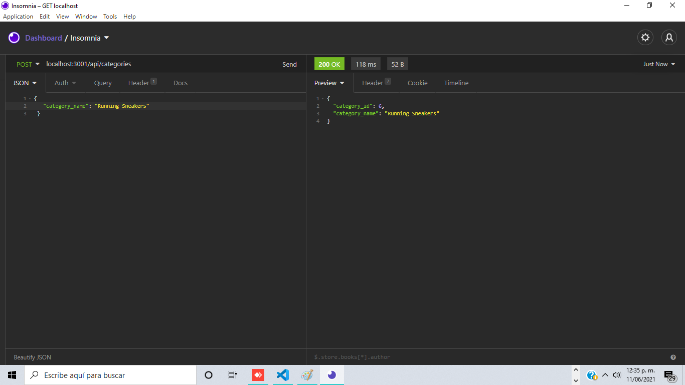

# 13 Object-Relational Mapping (ORM): E-Commerce Back End

It is an apllication build ussing mysql, sequelize, dotenv and express.

It has de following functionality

It has a seeds file that helps populate the DB.

It has a route to get all products with its Category and different Tags.

It has a route to modify existing products.

It has a route to add new product.

It has a route to delete a product.

It has a route to get all Categories with its related products.

It has a route to modify existing categories.

It has a route to add new categories.

It has a route to delete a categories.

It has a route to get all tags with its related products.

It has a route to modify existing tags.

It has a route to add new tags.

It has a route to delete a tags.

